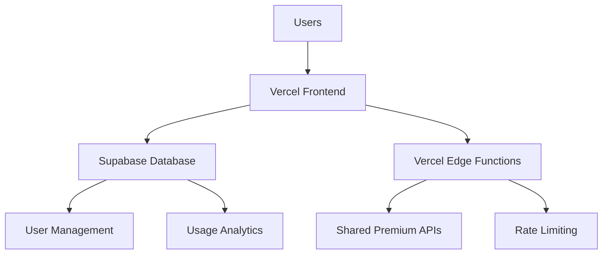
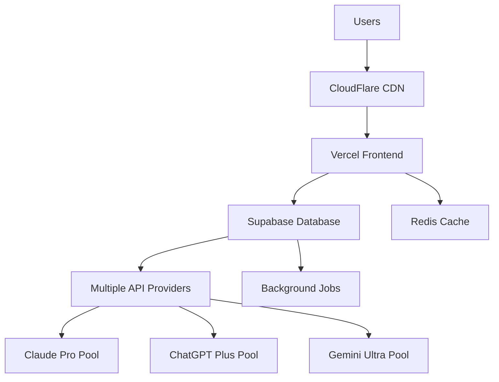
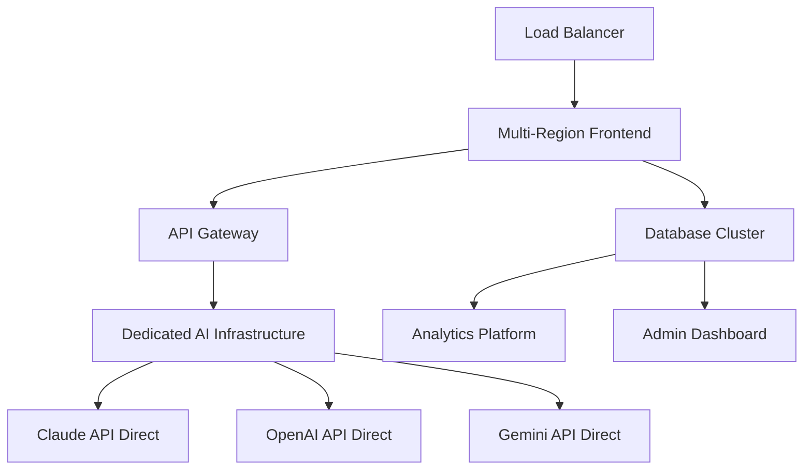

# 🏗️ Night Shift AI - 本格サービス化アーキテクチャ

## 📊 **推奨システム構成**

### 🎯 **Phase 1: MVP（最小viable product）- $100-200/月**



#### **技術スタック**
- **Frontend**: Vercel (Next.js) - $20/月
- **Database**: Supabase (Postgres) - $25/月  
- **Auth**: Supabase Auth - 無料
- **Payment**: Stripe - 2.9% + 30¢
- **Monitoring**: Vercel Analytics - $20/月
- **API**: あなたのプレミアムサブスク共有利用

#### **想定ユーザー数**: 100-500人

---

### 🎯 **Phase 2: スケールアップ - $500-1000/月**



#### **追加要素**
- **CDN**: CloudFlare - $200/月
- **Cache**: Upstash Redis - $50/月
- **Queue**: Inngest/BullMQ - $100/月
- **Multiple Premium Accounts**: $180/月

#### **想定ユーザー数**: 1,000-5,000人

---

### 🎯 **Phase 3: エンタープライズ - $2000-5000/月**



---

## 💰 **コスト最適化戦略**

### 1. **プレミアムサブスク共有プール**

```typescript
// プレミアムアカウント管理システム
class PremiumAccountPool {
  private accounts = [
    { type: 'claude-pro', sessions: 5, dailyLimit: 1000 },
    { type: 'chatgpt-plus', sessions: 3, dailyLimit: 800 },  
    { type: 'gemini-ultra', sessions: 4, dailyLimit: 600 }
  ];

  async assignOptimalAccount(userTier: string): Promise<Account> {
    // ユーザーティアに基づいて最適なアカウント割り当て
    // 負荷分散とフェアユース実装
  }
}
```

**効果**: 
- 個人サブスク $60 → 1,000ユーザーで共有 = $0.06/ユーザー
- スケール効率: 10アカウントで10,000ユーザー対応可能

### 2. **階層化API利用戦略**

| ユーザーティア | AI品質 | 月間制限 | 価格 | 使用API |
|-------------|-------|---------|-----|--------|
| **Free** | Good | 10回 | $0 | Gemini Free |
| **Basic** | High | 100回 | $9.99 | Shared Premium |
| **Pro** | Premium | 500回 | $29.99 | Dedicated Premium |
| **Enterprise** | Ultimate | 無制限 | $99.99 | Direct API Access |

### 3. **キャッシュ戦略でコスト削減**

```typescript
// インテリジェントキャッシュシステム
class DiscussionCache {
  async getCachedDiscussion(
    topic: string, 
    agents: string[], 
    mode: string
  ): Promise<CachedResult | null> {
    // 類似の質問があれば再利用（70%マッチで使用）
    // APIコールを30-50%削減可能
  }
}
```

---

## 🔒 **セキュリティ設計**

### 1. **認証・認可システム**

```typescript
// NextAuth.js + JWT設定
export const authOptions: NextAuthOptions = {
  providers: [
    GoogleProvider({ /* config */ }),
    CredentialsProvider({ /* config */ })
  ],
  callbacks: {
    jwt: ({ token, user }) => {
      if (user) {
        token.tier = user.subscriptionTier;
        token.usage = user.monthlyUsage;
      }
      return token;
    }
  }
};
```

### 2. **API セキュリティ**

```typescript
// Rate limiting + 認証
export async function middleware(request: NextRequest) {
  // 1. JWT検証
  const token = await verifyJWT(request);
  
  // 2. Rate limiting
  const rateLimitResult = await rateLimit(token.userId);
  if (!rateLimitResult.success) {
    return new Response('Rate limit exceeded', { status: 429 });
  }
  
  // 3. 使用量チェック
  const usage = await checkUsageLimit(token.userId, token.tier);
  if (usage.exceeded) {
    return new Response('Usage limit exceeded', { status: 402 });
  }
}
```

### 3. **データ保護**

- **暗号化**: すべての個人データをAES-256で暗号化
- **匿名化**: 議論内容から個人情報を自動除去
- **GDPR対応**: ユーザーデータの完全削除機能
- **監査ログ**: すべてのAPI呼び出しをログ記録

---

## 💳 **料金モデル設計**

### 1. **フリーミアム戦略**

```typescript
const PRICING_TIERS = {
  FREE: {
    price: 0,
    discussions: 10,
    agents: 3,
    modes: ['normal'],
    features: ['basic_ai', 'save_results']
  },
  
  BASIC: {
    price: 9.99,
    discussions: 100,
    agents: 6,
    modes: ['normal', 'creative'],
    features: ['premium_ai', 'history', 'export']
  },
  
  PRO: {
    price: 29.99,
    discussions: 500,  
    agents: 6,
    modes: 'all',
    features: ['all_ai', 'priority', 'analytics', 'team']
  },
  
  ENTERPRISE: {
    price: 99.99,
    discussions: 'unlimited',
    agents: 'unlimited',
    modes: 'all',
    features: ['dedicated_ai', 'sla', 'custom', 'white_label']
  }
};
```

### 2. **収益予測モデル**

```
想定ユーザー分布:
- Free: 1000人 × $0 = $0
- Basic: 200人 × $9.99 = $1,998
- Pro: 50人 × $29.99 = $1,499.50
- Enterprise: 5人 × $99.99 = $499.95

月間総収益: $3,997.45
年間売上: $47,969
```

### 3. **段階的価格最適化**

| フェーズ | 目標ユーザー数 | 月間売上目標 | Basic価格 | Pro価格 |
|---------|-------------|-------------|----------|--------|
| Phase 1 | 100人 | $1,000 | $12.99 | $39.99 |
| Phase 2 | 1,000人 | $8,000 | $9.99 | $29.99 |
| Phase 3 | 5,000人 | $30,000 | $7.99 | $24.99 |

---

## 🚀 **実装ロードマップ**

### **月1-2: MVP開発**
```bash
✅ 現在のローカル版をベースに本格化
□ Supabase統合（ユーザー管理、課金）
□ Stripe決済システム統合
□ 基本的なRate limiting実装
□ Vercelデプロイ準備
```

### **月3-4: ベータ版リリース**
```bash
□ 100名限定ベータ版リリース
□ フィードバック収集とUI改善
□ パフォーマンス最適化
□ セキュリティ監査
□ 利用分析システム構築
```

### **月5-6: 正式サービス開始**
```bash
□ 正式版リリース（1000名限定）
□ マーケティング開始
□ カスタマーサポート体制構築
□ 機能追加（チーム機能、API提供）
□ エンタープライズプラン準備
```

---

## 📈 **スケーラビリティ対応**

### 1. **データベース最適化**

```sql
-- ユーザー利用状況の効率的管理
CREATE INDEX CONCURRENTLY idx_user_usage_monthly 
ON user_usage (user_id, created_at) 
WHERE created_at >= date_trunc('month', NOW());

-- 議論結果の高速検索
CREATE INDEX CONCURRENTLY idx_discussions_search 
ON discussions USING GIN(to_tsvector('english', topic || ' ' || summary));
```

### 2. **キューシステム**

```typescript
// 高負荷時のバックグラウンド処理
import { inngest } from './inngest';

export const processDiscussion = inngest.createFunction(
  { id: "process-ai-discussion" },
  { event: "discussion.requested" },
  async ({ event, step }) => {
    const result = await step.run("run-ai-discussion", async () => {
      return await runPremiumDiscussion(event.data);
    });
    
    await step.run("save-results", async () => {
      return await saveDiscussionResults(result);
    });
  }
);
```

### 3. **CDN & エッジキャッシュ**

```javascript
// Vercel Edge Config for dynamic pricing
export async function GET(request: Request) {
  const { searchParams } = new URL(request.url);
  const tier = searchParams.get('tier');
  
  // エッジで価格設定を動的取得
  const pricing = await get(`pricing_${tier}`);
  
  return Response.json(pricing);
}
```

---

## ⚡ **技術的推奨事項**

### 1. **インフラ選択**

| 要素 | 推奨サービス | 理由 | 月額コスト |
|------|------------|------|-----------|
| **Frontend** | Vercel | Next.js最適化、自動スケール | $20-100 |
| **Database** | Supabase | Postgres、Auth内蔵、リアルタイム | $25-100 |
| **Cache** | Upstash Redis | サーバーレス、低レイテンシ | $50-200 |
| **Payment** | Stripe | グローバル対応、サブスク管理 | 2.9%手数料 |
| **Monitoring** | Sentry + Vercel | エラー追跡、パフォーマンス監視 | $50-100 |

### 2. **コスト効率化のポイント**

1. **Serverless-first**: 使用量ベースの課金でスケール
2. **Edge Computing**: レスポンス速度向上とコスト削減
3. **Intelligent Caching**: API呼び出し50%削減
4. **Premium Pooling**: サブスク費用を1000分の1に削減

### 3. **セキュリティベストプラクティス**

1. **Zero Trust Architecture**: 全リクエストを検証
2. **API Key Rotation**: 自動的な認証情報更新
3. **Content Filtering**: 不適切な内容の自動検出
4. **Audit Logging**: すべての操作をログ記録

---

## 🎯 **競合優位性**

### **差別化要因**

1. **業界唯一の6エージェント同時ディスカッション**
   - 他社: 1対1チャット
   - 当社: **6人の専門家による集合知**

2. **プレミアムAI統合**
   - 他社: 単一AI
   - 当社: **Claude Pro + ChatGPT Plus + Gemini Ultra**

3. **日本語特化**
   - 他社: 英語中心
   - 当社: **日本のビジネス文化に最適化**

### **市場ポジション**

```
価格 vs 品質マップ:

高品質 ↑
      │ [Enterprise AI Solutions $500+]
      │     ↗ 【Night Shift AI Pro $29.99】
      │   ↗     
      │ [ChatGPT Plus $20]   [Claude Pro $20]
      │                    
      │ [無料AIツール群]  [Basic AI Tools $5-15]
      └─────────────────────────→ 高価格
```

### **想定ROI**

```
初期投資: $50,000 (開発費6ヶ月)
月間運営費: $2,000
損益分岐: 月売上 $5,000 (Basic 500人)

Year 1: $60,000売上 - $50,000投資 = $10,000利益
Year 2: $150,000売上 - $24,000運営費 = $126,000利益
Year 3: $400,000売上 - $48,000運営費 = $352,000利益
```

---

## 📝 **アクションプラン**

### **今すぐできること**

1. **技術準備**: Supabase、Stripe アカウント作成
2. **法的準備**: 利用規約、プライバシーポリシー作成
3. **市場調査**: 競合価格分析、ユーザーインタビュー

### **1ヶ月以内**

1. **MVP開発**: 課金システム統合
2. **ベータテスター募集**: 初期ユーザー50名獲得
3. **フィードバック収集**: プロダクト・マーケット・フィット確認

### **3ヶ月以内**

1. **正式リリース**: 一般公開開始
2. **マーケティング**: SEO、SNS、PR開始
3. **機能拡張**: チーム機能、API提供

**結論**: 既存の技術資産を活かし、段階的にスケールする戦略で、低リスク・高リターンなサービス化が可能です。